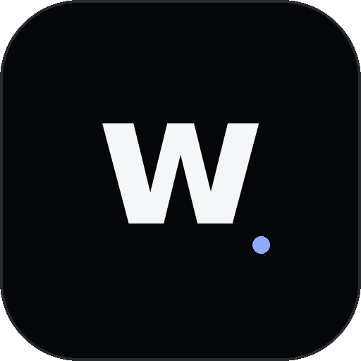

<div align="center">
  

# BurnedWolf

**A Windows network utility for DPI filtering, encrypted DNS, diagnostics, integrity repair, and BurnedCord.**

Built and maintained under **[whyscripts.com](https://whyscripts.com/)**.

[](package.json)
[](#requirements)
[](package.json)
[](LICENSE)

[Website](https://burnedwolf.whyscripts.com/) · [Report a bug](https://github.com/iamnoobhasproject/burnedwolf/issues) · [WhyScripts](https://whyscripts.com/)
</div>

---

## What is BurnedWolf?

BurnedWolf is a Windows desktop utility that brings several network tools into one interface. It can manage DPI-bypass profiles, encrypted DNS, network analysis, file-integrity repair, Tor helpers, and the integrated BurnedCord desktop voice client.

The project is designed around a simple idea: common network fixes should be easy to turn on, inspect, undo, repair, and update without manually juggling scripts and command-line tools.

**Privacy by design:** BurnedWolf does not require an account for its core network features and does not collect usage telemetry, connection history, device identifiers, or user activity. Updates are optional. Because of this design, we intentionally do not maintain active-user statistics.

> **Important:** BurnedWolf changes system/network state and therefore runs with administrator privileges. Only install builds from the official project links and review the source if you want to understand exactly what a feature changes.

## Highlights

| Feature | What it does |
| --- | --- |
| **DPI protection** | Runs the bundled DPI engine with selectable profiles and automatic profile handling. |
| **ISP-aware profiles** | Detects the active ISP and can recommend an appropriate protection profile. |
| **Encrypted DNS** | Runs a local encrypted DNS resolver and can use providers such as Cloudflare or Quad9. |
| **Crash-safe DNS restore** | Saves the original DNS configuration and repairs stale loopback DNS state after an abnormal shutdown. |
| **Network analysis** | Tests profiles against real services and ranks results before applying the best option. |
| **Custom profiles** | Create, clone, import, export, and manage custom DPI profiles. |
| **Integrity repair** | Compares bundled runtime files with the official repair bundle and restores missing/corrupt files. |
| **Tor tools** | Manages the bundled Tor process and supports bridge/pluggable-transport configuration. |
| **BurnedCord** | Separate desktop voice window with camera/screen sharing, system-audio support, native clipboard integration, and Windows-global push-to-talk. |
| **Dual update system** | Lightweight app updates are separate from full Electron/Core runtime updates so older installations can migrate safely. |

## BurnedCord

BurnedCord is integrated into BurnedWolf but opens in its own desktop window and tray entry. The desktop shell uses the canonical `https://chat.whyscripts.com/app/` client and adds Electron-specific capabilities such as native screen-source selection, system-audio capture support, native clipboard access, and Windows-global push-to-talk.

The hosted BurnedCord service is a separate component; this repository contains the BurnedWolf desktop integration layer.

## Requirements

- **Windows 10 or Windows 11 (64-bit recommended)**
- Administrator privileges
- Internet connection for update checks and online-backed features
- A network adapter supported by the Windows networking commands used by the application

BurnedWolf is currently Windows-focused. Its networking layer relies on Windows APIs, PowerShell, `netsh`, WinDivert-based tooling, and Windows-specific runtime binaries.

## Installation

### Recommended

Download the current Windows installer from the official BurnedWolf page:

**https://burnedwolf.whyscripts.com/**

The installer is built as `BurnedWolf-Setup.exe` and requests administrator privileges because the application may change DNS configuration and run network filtering components.

### Run from source

```bash
git clone https://github.com/iamnoobhasproject/burnedwolf.git
cd burnedwolf
npm install
npm start
```

For full packaged functionality, the runtime binary directories expected by the project must be present. See [Building from source](docs/BUILDING.md) before producing a distributable build.

## Project structure

```text
burnedwolf/
├─ main.js                 # Electron entry shim
├─ src/main/               # Main-process modules
│  ├─ zapret/              # DPI engine, profiles, hostlists, payloads, blockcheck
│  ├─ ai/                  # Optional AI integration helpers
│  ├─ dns.js               # DNS + dnscrypt-proxy lifecycle and recovery
│  ├─ tor.js               # Tor lifecycle
│  ├─ burnedcord.js        # BurnedCord desktop shell / native bridge
│  ├─ updater.js           # Lightweight app.asar update pipeline
│  ├─ coreUpdate.js        # Full Electron/Core runtime update pipeline
│  ├─ distribution.js      # Central public distribution/update endpoints
│  ├─ verify.js            # Integrity verification / repair
│  └─ windows.js           # Windows, tray, IPC
├─ renderer/               # Main BurnedWolf interface
├─ i18n/                   # Localized UI strings
├─ brand/                  # WhyScripts/BurnedWolf brand assets
├─ tools/                  # Build/update/migration checks
└─ package.json            # Electron + electron-builder configuration
```

For a deeper overview, see [Architecture](docs/ARCHITECTURE.md).

## Safety and recovery

Network utilities can leave the system in a bad state if they are terminated at the wrong moment. BurnedWolf includes explicit cleanup and recovery paths:

- the original DNS configuration is captured before encrypted DNS takes control;
- DNS is restored on a normal quit;
- stale `127.0.0.1` / `::1` resolver state can be detected and repaired on the next launch;
- Tor, DPI, DNS and local proxy processes are included in the application shutdown cleanup order;
- the integrity tool can re-download the official repair bundle for missing or corrupt runtime files.

If something goes wrong, read [Troubleshooting](docs/TROUBLESHOOTING.md) before manually changing system settings.

## Update architecture

BurnedWolf uses two independent update channels.

### Application updates

Routine code/UI fixes can be delivered as a lightweight `app.asar` package without replacing the full installation. The maintained v2 application channel uses `version-v2.json` + `app-v2.zip`.

The original `version.json` + `update.zip` channel is intentionally frozen as the legacy Electron-26 bridge channel. This prevents an untouched old installation from receiving an `app.asar` that requires a newer Electron runtime.

### Core / Electron updates

Changes that require a new Electron/Chromium/Node runtime are delivered as a full NSIS Core update. The Core manifest is separate (`core-version.json`) and can enforce a minimum bridge version before the update is offered.

During migration from the legacy Electron 26 installation, the bridge downloads the full installer, verifies its SHA-256 value from the Core manifest, and launches the normal installer. Once BurnedWolf is on the modern Core build, full runtime releases use `electron-updater` / NSIS while lightweight application updates remain separate.

This split is deliberate: a new `app.asar` is never supposed to strand a user on an incompatible Electron runtime.

## Project history

BurnedWolf has been actively developed through hundreds of development iterations and updates. Earlier versions of the project were hosted in repositories that are no longer available, so the commit history of this repository does not represent the full development history of BurnedWolf.

The current repository is the maintained public source going forward.

## Development

Useful commands for the current Electron 44 source line:

```bash
npm install
npm start
```
Build a Windows NSIS Core installer:

```bash
npm run dist:core
```

Build the lightweight v2 application-update package:

```bash
npm run pack:app-v2
```

The production dependency audit should remain clean:

```bash
npm audit --omit=dev
```

Do **not** use `npm audit fix --force` as a release step. A forced dependency rewrite can change tested build/runtime versions.

If you use the obfuscated distribution command, build from a clean/disposable working copy and verify `git status` before and after building.

See:

- [Building from source](docs/BUILDING.md)
- [Architecture](docs/ARCHITECTURE.md)
- [Troubleshooting](docs/TROUBLESHOOTING.md)
- [Release notes](CHANGELOG.md)
- [Contributing](CONTRIBUTING.md)
- [Security policy](SECURITY.md)

## Contributing

Bug reports and focused pull requests are welcome. For larger changes, open an issue first so the approach can be discussed before a large patch is written.

Please keep changes scoped, avoid committing secrets or generated runtime bundles, and preserve cleanup/recovery behaviour when touching DNS, DPI, Tor, updater, Core migration, or Electron lifecycle code.

## Third-party components

BurnedWolf uses and/or distributes third-party open-source components. These components are **not relicensed under BurnedWolf's MIT License** and remain subject to their own licenses and copyright notices.

Notable components include:

- **Zapret** — MIT License
- **dnscrypt-proxy** — ISC License
- **WinDivert** — LGPLv3 or GPLv2, at the recipient's choice
- **Tor** — distributed under the Tor Project's applicable license terms
- **Electron, electron-updater and npm dependencies** — subject to their respective upstream licenses

See [`THIRD_PARTY_NOTICES.md`](THIRD_PARTY_NOTICES.md) and the license files shipped with third-party runtime components for details.

## License

BurnedWolf's **original source code** is licensed under the [MIT License](LICENSE).

Copyright © 2026 **iamnoobhasproject**.

This license applies only to code and other material for which the BurnedWolf copyright holder has the right to grant a license. Third-party components bundled with or used by BurnedWolf retain their own licenses, copyright notices, and redistribution requirements.

## Links

- BurnedWolf: **https://burnedwolf.whyscripts.com/**
- WhyScripts: **https://whyscripts.com/**
- BurnedCord service: **https://chat.whyscripts.com/**
- Source: **https://github.com/iamnoobhasproject/burnedwolf**

<div align="center">
  <sub>BurnedWolf · a WhyScripts project</sub>
</div>
